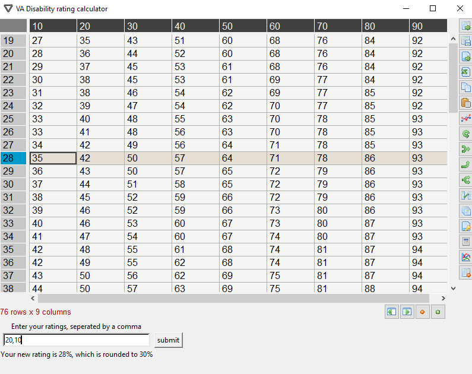

# PercentageRatings
Working at the VA on campus, I noticed many students were concerned and waiting on their ratings. I decided to write a short program to figure out the potential rating.

First, program utilizes the BeautifulSoup4 and Requests library to pull a table from the VA website.
Then, it saves the columns and index values, and pulls the remaining values into a list - and reshapes that list into the dataframe
After, the program creates the GUI and puts the Dataframe on the tkiner pane using pandastable.
Finally, you can input your ratings with a comma, and returns your new rating.

requires:
pip install:
beautifulsoup4
requests
pandas
numpy
pandastable
